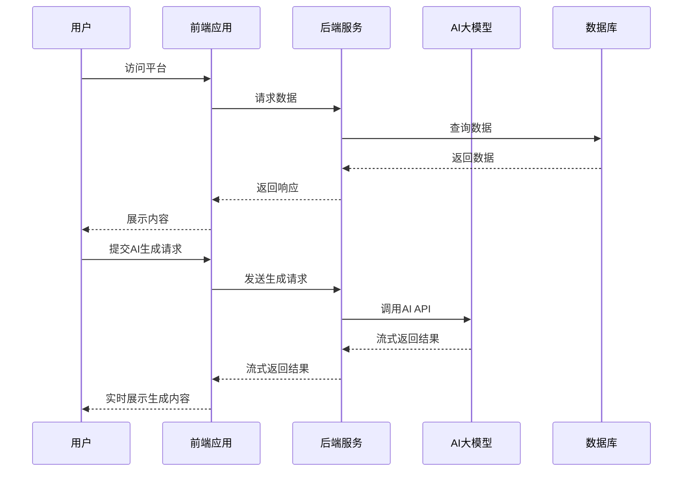

# AI智能内容创作平台技术文档

## 1. 项目概述

本项目是一个结合了**全民简历网**和**秒哒无代码平台**核心功能的AI智能内容创作平台，旨在为用户提供一站式的AI辅助内容创作服务，包括简历生成、无代码应用搭建、AI内容生成等功能。

## 2. 技术架构

### 2.1 技术栈

- **前端**：Vue3 + Vite + Element Plus + Pinia + Axios
- **后端**：Node.js + Express + MySQL2 + JWT + CORS
- **AI接入**：DeepSeek/字节豆包/阿里云通义千问API
- **部署**：前端Vercel + 后端Railway + 数据库TiDB Cloud

### 2.2 系统架构

## 3. 核心功能模块

### 3.1 简历生成模块

**功能描述**：结合全民简历网的模板系统，利用AI生成个性化简历内容。

**技术实现**：

- 前端：简历模板选择、实时预览、编辑功能
- 后端：模板管理、AI内容生成、简历导出
- 数据库：用户简历存储、模板管理

**核心流程**：

1. 用户选择简历模板
2. 填写个人基本信息
3. AI根据用户信息生成简历内容
4. 用户编辑和调整
5. 导出为PDF或其他格式

### 3.2 无代码应用搭建模块

**功能描述**：参考秒哒平台，实现通过自然语言描述快速搭建应用的功能。

**技术实现**：

- 前端：可视化编辑器、组件库、实时预览
- 后端：应用模板管理、AI代码生成、应用部署
- 数据库：用户应用存储、组件配置管理

**核心流程**：

1. 用户输入应用需求描述
2. AI生成应用结构和代码
3. 用户通过可视化编辑器调整
4. 预览和测试应用
5. 部署和分享应用

### 3.3 AI内容生成模块

**功能描述**：提供多场景的AI内容生成功能，包括文章、摘要、标题等。

**技术实现**：

- 前端：生成参数配置、流式展示、结果管理
- 后端：AI API调用、流式响应处理、历史记录管理
- 数据库：生成历史存储、用户使用统计

**核心流程**：

1. 用户选择生成类型
2. 输入生成指令
3. AI流式生成内容
4. 用户查看和编辑结果
5. 保存或导出结果

### 3.4 用户管理模块

**功能描述**：管理用户账号、权限、使用次数等。

**技术实现**：

- 前端：登录注册、个人中心、权限管理
- 后端：用户认证、权限控制、使用统计
- 数据库：用户信息存储、使用记录管理

**核心流程**：

1. 用户注册/登录
2. 查看个人信息和使用统计
3. 管理账号设置
4. 查看使用历史

## 4. 数据库设计

### 4.1 表结构

**用户表 (users)**

| 字段名          | 数据类型         | 描述       |
| ------------ | ------------ | -------- |
| id           | INT          | 用户ID     |
| username     | VARCHAR(20)  | 用户名      |
| password     | VARCHAR(100) | 密码（加密）   |
| nickname     | VARCHAR(20)  | 昵称       |
| email        | VARCHAR(50)  | 邮箱       |
| ai\_count    | INT          | 每日AI调用次数 |
| create\_time | DATETIME     | 创建时间     |
| update\_time | DATETIME     | 更新时间     |

**简历表 (resumes)**

| 字段名          | 数据类型         | 描述   |
| ------------ | ------------ | ---- |
| id           | INT          | 简历ID |
| user\_id     | INT          | 所属用户 |
| template\_id | INT          | 模板ID |
| title        | VARCHAR(100) | 简历标题 |
| content      | LONGTEXT     | 简历内容 |
| create\_time | DATETIME     | 创建时间 |
| update\_time | DATETIME     | 更新时间 |

**应用表 (applications)**

| 字段名          | 数据类型         | 描述         |
| ------------ | ------------ | ---------- |
| id           | INT          | 应用ID       |
| user\_id     | INT          | 所属用户       |
| name         | VARCHAR(100) | 应用名称       |
| description  | TEXT         | 应用描述       |
| structure    | LONGTEXT     | 应用结构（JSON） |
| status       | VARCHAR(20)  | 应用状态       |
| create\_time | DATETIME     | 创建时间       |
| update\_time | DATETIME     | 更新时间       |

**AI生成历史表 (ai\_histories)**

| 字段名          | 数据类型        | 描述   |
| ------------ | ----------- | ---- |
| id           | INT         | 历史ID |
| user\_id     | INT         | 用户ID |
| prompt       | TEXT        | 输入指令 |
| result       | LONGTEXT    | 生成结果 |
| type         | VARCHAR(20) | 生成类型 |
| create\_time | DATETIME    | 创建时间 |

**模板表 (templates)**

| 字段名          | 数据类型         | 描述          |
| ------------ | ------------ | ----------- |
| id           | INT          | 模板ID        |
| name         | VARCHAR(100) | 模板名称        |
| type         | VARCHAR(20)  | 模板类型（简历/应用） |
| structure    | LONGTEXT     | 模板结构（JSON）  |
| create\_time | DATETIME     | 创建时间        |

## 5. API设计

### 5.1 用户相关

| 接口路径               | 请求方式 | 功能描述   |
| ------------------ | ---- | ------ |
| /api/user/register | POST | 用户注册   |
| /api/user/login    | POST | 用户登录   |
| /api/user/info     | GET  | 获取用户信息 |
| /api/user/update   | POST | 更新用户信息 |

### 5.2 简历相关

| 接口路径                      | 请求方式   | 功能描述   |
| ------------------------- | ------ | ------ |
| /api/resume/list          | GET    | 获取简历列表 |
| /api/resume/add           | POST   | 添加简历   |
| /api/resume/detail/:id    | GET    | 获取简历详情 |
| /api/resume/update        | POST   | 更新简历   |
| /api/resume/delete/:id    | DELETE | 删除简历   |
| /api/resume/export/:id    | GET    | 导出简历   |
| /api/resume/template/list | GET    | 获取模板列表 |

### 5.3 应用相关

| 接口路径                | 请求方式   | 功能描述   |
| ------------------- | ------ | ------ |
| /api/app/list       | GET    | 获取应用列表 |
| /api/app/add        | POST   | 添加应用   |
| /api/app/detail/:id | GET    | 获取应用详情 |
| /api/app/update     | POST   | 更新应用   |
| /api/app/delete/:id | DELETE | 删除应用   |
| /api/app/deploy/:id | POST   | 部署应用   |
| /api/app/generate   | POST   | AI生成应用 |

### 5.4 AI相关

| 接口路径             | 请求方式 | 功能描述       |
| ---------------- | ---- | ---------- |
| /api/ai/generate | POST | AI内容生成（流式） |
| /api/ai/history  | GET  | 获取AI生成历史   |
| /api/ai/count    | GET  | 获取AI调用次数   |

## 6. 前端设计

### 6.1 页面结构

1. **首页**：平台介绍、功能导航、快速入口
2. **登录/注册页**：用户认证
3. **简历生成页**：模板选择、信息填写、AI生成、预览编辑
4. **应用搭建页**：需求输入、AI生成、可视化编辑、预览部署
5. **AI内容生成页**：生成类型选择、指令输入、流式展示、结果管理
6. **个人中心**：用户信息、使用统计、历史记录

### 6.2 界面设计

- **风格**：现代简洁、专业高效
- **配色**：主色调 #409EFF（蓝色），辅助色 #67C23A（绿色）
- **响应式**：适配桌面端、平板端、移动端
- **交互**：流畅的动画效果、实时反馈、智能提示

## 7. 后端设计

### 7.1 核心模块

1. **用户认证模块**：JWT身份验证、密码加密、权限控制
2. **AI调用模块**：API调用、流式响应、错误处理
3. **模板管理模块**：模板存储、模板渲染、模板更新
4. **应用管理模块**：应用生成、应用部署、应用监控
5. **数据分析模块**：使用统计、性能分析、用户行为分析

### 7.2 安全设计

- **密码加密**：使用bcrypt加密存储密码
- **JWT认证**：无状态身份验证，设置合理的过期时间
- **API限流**：防止恶意请求，保护AI API
- **CORS配置**：安全的跨域请求
- **数据验证**：输入验证，防止注入攻击

## 8. 部署方案

### 8.1 前端部署

- **平台**：Vercel
- **步骤**：
  1. 将前端代码上传至GitHub仓库
  2. 在Vercel中导入仓库
  3. 配置环境变量
  4. 自动部署

### 8.2 后端部署

- **平台**：Railway
- **步骤**：
  1. 将后端代码上传至GitHub仓库
  2. 在Railway中导入仓库
  3. 配置环境变量
  4. 自动部署

### 8.3 数据库部署

- **平台**：TiDB Cloud
- **步骤**：
  1. 创建TiDB Cloud账户
  2. 创建数据库集群
  3. 配置连接信息
  4. 初始化数据库表结构

## 9. 性能优化

1. **前端优化**：
   - 组件懒加载
   - 资源压缩
   - 缓存策略
   - 代码分割
2. **后端优化**：
   - 数据库连接池
   - 缓存机制
   - 异步处理
   - 负载均衡
3. **AI调用优化**：
   - 流式响应
   - 请求缓存
   - 批量处理
   - 错误重试

## 10. 后续扩展

1. **功能扩展**：
   - 多语言支持
   - 更多模板类型
   - 高级AI模型
   - 团队协作功能
2. **技术扩展**：
   - 微服务架构
   - 容器化部署
   - CI/CD流程
   - 监控系统
3. **商业模式**：
   - 免费基础版
   - 付费高级版
   - 企业定制版
   - API服务

## 11. 风险评估

1. **技术风险**：
   - AI API调用失败
   - 数据库连接问题
   - 服务器性能瓶颈
2. **业务风险**：
   - 用户需求变化
   - 市场竞争
   - 政策法规变化
3. **解决方案**：
   - 多AI模型备份
   - 数据库高可用
   - 弹性伸缩
   - 持续市场调研

## 12. 开发计划

### 12.1 阶段规划

1. **第一阶段**：基础架构搭建
   - 前端框架搭建
   - 后端服务搭建
   - 数据库设计
2. **第二阶段**：核心功能实现
   - 用户管理模块
   - AI内容生成模块
   - 简历生成模块
3. **第三阶段**：高级功能开发
   - 无代码应用搭建
   - 模板系统
   - 导出功能
4. **第四阶段**：测试和优化
   - 功能测试
   - 性能优化
   - 安全测试
5. **第五阶段**：部署和上线
   - 生产环境部署
   - 监控系统搭建
   - 用户反馈收集

### 12.2 时间估算

| 阶段   | 时间 | 任务     |
| ---- | -- | ------ |
| 第一阶段 | 2周 | 基础架构搭建 |
| 第二阶段 | 3周 | 核心功能实现 |
| 第三阶段 | 4周 | 高级功能开发 |
| 第四阶段 | 2周 | 测试和优化  |
| 第五阶段 | 1周 | 部署和上线  |

## 13. 总结

本技术文档详细描述了AI智能内容创作平台的技术架构、功能模块、数据库设计、API设计、前端设计、后端设计、部署方案、性能优化、后续扩展、风险评估和开发计划。

通过整合全民简历网的模板系统和秒哒平台的无代码应用搭建功能，结合AI大模型的能力，本平台将为用户提供一站式的AI辅助内容创作服务，帮助用户快速生成高质量的简历、应用和其他内容。

该平台具有良好的可扩展性和可维护性，能够满足用户的多样化需求，为用户创造价值。

## UI设计

### 1. 首页

!\[首页]\(C:\Users\Lenovo\Desktop\Resume\AI-Resume\src\UI\body(1).png)

#### 简历生成模块

!\[简历生成模块]\(C:\Users\Lenovo\Desktop\Resume\AI-Resume\src\UI\body.png)

#### AI内容生成模块

!\[AI内容生成模块]\(C:\Users\Lenovo\Desktop\Resume\AI-Resume\src\UI\body(4).png)

#### 应用搭建模块

!\[应用搭建模块]\(C:\Users\Lenovo\Desktop\Resume\AI-Resume\src\UI\body(2).png)

### 个人中心

!\[个人中心]\(C:\Users\Lenovo\Desktop\Resume\AI-Resume\src\UI\body(3).png)
